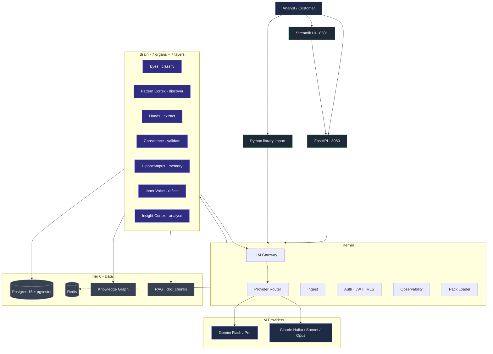
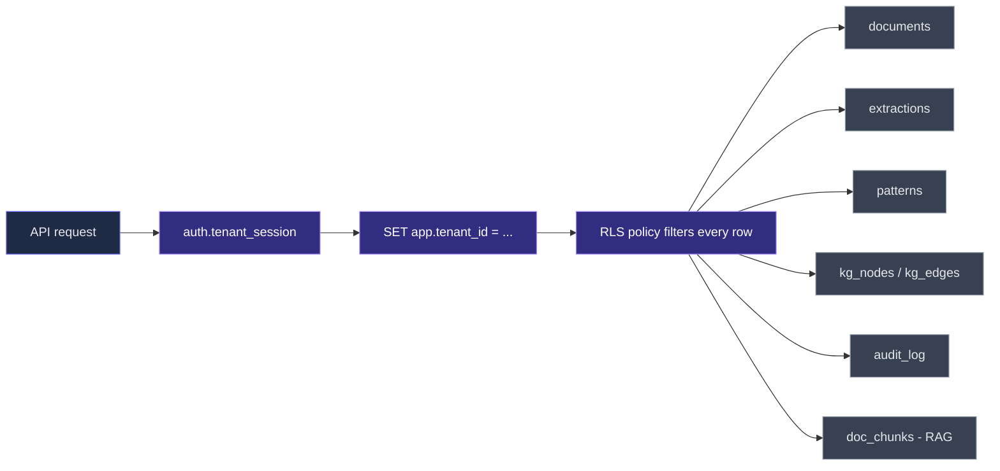
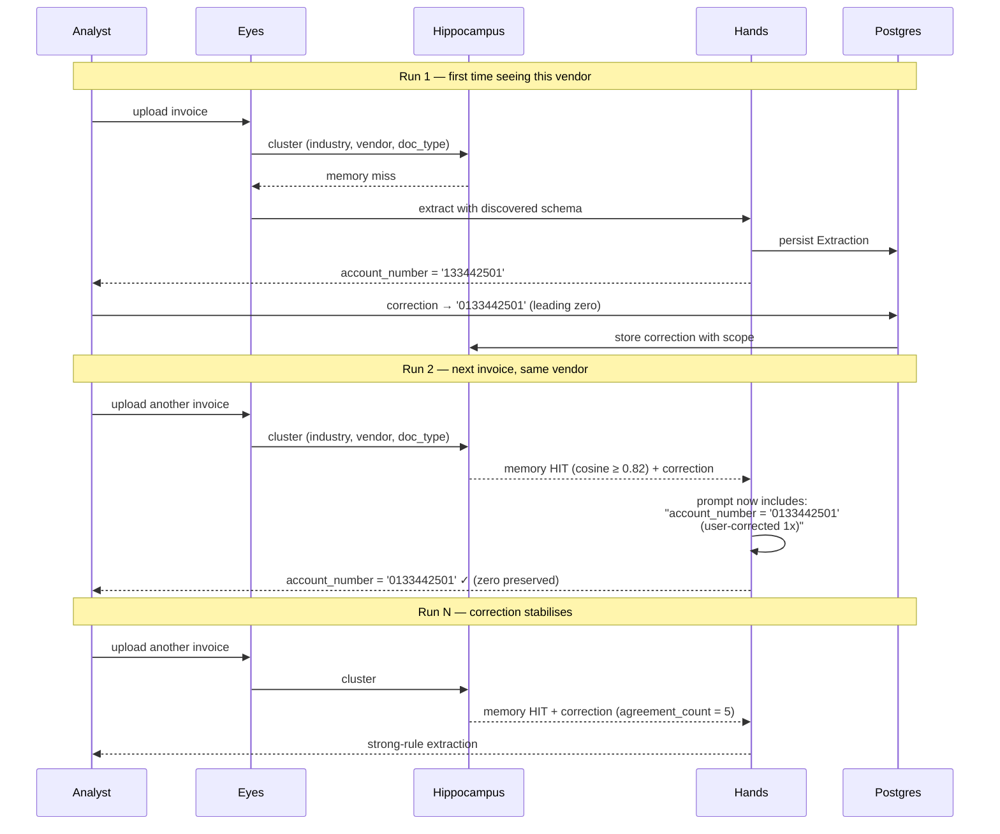
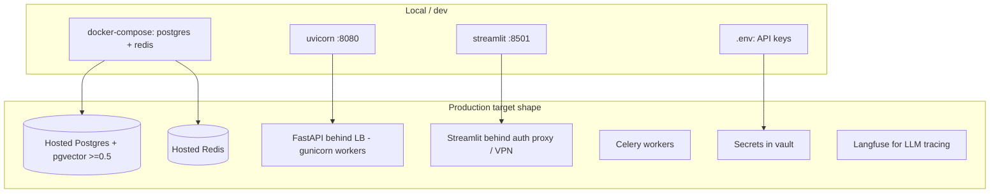
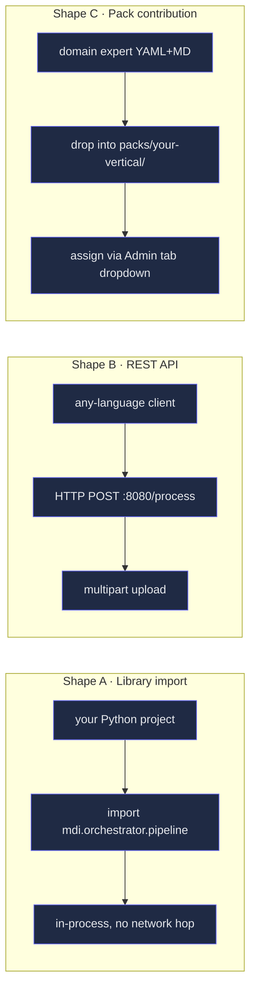
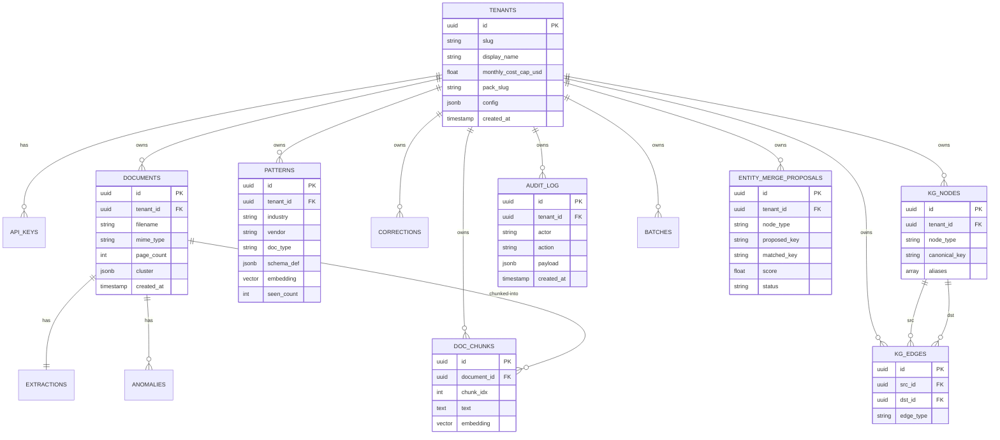

# MDI · Architecture Overview

**Audience: Tech architect reviewing for adoption / extension / handoff.**
**Last updated: 2026-06-03.**

This document is the one-stop architectural reference. It links to deeper material where useful but is meant to stand on its own for a 20-minute read.

> **Deeper docs in this repo:** `README.md` (runbook) · `CLAUDE.md` (locked decisions) · `MODULE_GUIDE.md` (consumer integration) · `PIPELINE_AND_FRAMEWORK.md` (developer-facing pipeline) · `GAP_ANALYSIS.md` (what's missing) · `mdi/src/mdi/packs/business_documents_base/` (canonical pack example).

---

## 1. TL;DR

MDI is an **autonomous, multi-tenant document-intelligence brain** built on Postgres + pgvector. A document goes in; a typed, validated, knowledge-graph-enriched `BatchReport` comes out. The same engine handles invoices, claims, contracts, statements, and receipts across telecom / healthcare / cloud finance / legal / manufacturing **without per-domain configuration** in its default open-vocabulary mode. Customer corrections persist to a per-tenant pattern memory and replay automatically on the next similar document — that is the "self-training" property, and it is mechanically a corrections-replay loop, not gradient-descent training.

The platform is reusable as a **Python library**, a **REST API**, or via **vertical packs** (YAML + Markdown, no Python). Six vertical pack templates ship today (`business_documents_base`, `telecom_billing`, `cloud_finance`, `healthcare_claims`, `manufacturing`, `legal_hr`); a new vertical takes 1–2 weeks per the synthesis doc's Appendix A.7 spec, with the framework already in place to validate and assign them.

Production posture today: **kernel + 7 organs + 7 supporting layers + RLS + provider fallback chain + audit + RAG + EvalLayers all live**; **44/44 offline tests + live LLM regression suite green**; **stub embedder is the only remaining "demo-vs-prod" gap** (real bge-m3 toggle ships behind one env flag). Honest delta from a production launch: customer-facing onboarding flow polish, golden-dataset accuracy gates per pack, and a security review for regulated industries.

---

## 2. System overview



Three things to notice:

1. **Kernel is the only thing the Brain talks to for I/O.** Organs never call Postgres or LLM APIs directly — they go through `tenant_session()` and `llm_gateway.generate()`. That's what makes them swappable.
2. **Provider router sits between the gateway and the LLMs.** The brain says "I need synthesis-tier inference"; the router picks Gemini primary or Claude fallback per the locked policy.
3. **Three UI surfaces — same kernel.** Streamlit (analyst), FastAPI (programmatic), and direct library import (in-process) all hit the same orchestrator. No business logic in any UI.

---

## 3. The 19-stage processing pipeline


| Phase | Stages | What it produces |
|---|---|---|
| 1 — per-doc | 0–9 | Classified, extracted, validated `Extraction` per document; pattern + RAG chunks persisted |
| 2 — batch | 10–13 | Cross-document `Insights`, `Reflection`, `DocumentGroups`, coverage classification |
| 3 — report | 14–16 | `AccountBriefing` per group, narrator summary, assembled `BatchReport` |
| 4 — graph | 17–19 | KG node/edge upserts with entity resolution, graph centrality insights, cross-doc validation |

**LLM hits per stage** — only 6 out of 19 stages call an LLM: `2 classify`, `4 schema discovery`, `5 rule invention` (gated off in production), `7 extract`, `15 narrator`, and optionally `10 insight narration`. Every other stage is deterministic Python.

**Cost profile from live measurement**: cold-start batch ≈ $0.015/doc (Gemini); memory-hit batch ≈ $0.005/doc (67% reduction because Pattern Cortex is skipped on hits).

---

## 4. Tech stack

| Layer | Technology | Why this choice |
|---|---|---|
| LLM — perception / extraction | Gemini 2.5 Flash + Vision | Cheap, multimodal, fast |
| LLM — reasoning / synthesis | Gemini 2.5 Pro · Claude Opus 4.1 (fallback) | Long context, calibrated reasoning, vendor resilience |
| LLM gateway | Custom, async, tier-routed, with tenacity retry | Provider-agnostic brain, single chokepoint for cost + observability |
| Embeddings | `sentence-transformers BAAI/bge-m3` (real) or SHA-stub (dev) | 1024-dim, multilingual; stub for offline tests |
| Structured memory | Postgres 15 + JSONB | Standard, queryable, audit-friendly |
| Vector memory | pgvector HNSW (cosine) | Same DB as structured data — one ops surface |
| Document parsing | pypdf, python-docx, openpyxl, pandas, Pillow | Battle-tested, 11 file formats |
| Pack format | YAML + Markdown | Domain experts can author without Python |
| Knowledge graph | Postgres-backed adjacency (`kg_nodes`, `kg_edges`) | RLS-isolated; NetworkX-shaped read API |
| API backend | FastAPI + Pydantic v2 | Async-first, typed, OpenAPI-native |
| Job queue | Celery + Redis | Battle-tested; supports long-running batches |
| Analyst UI | Streamlit | Fastest path from Python to UX |
| Customer-facing UI | React + Tailwind (deferred v1.1+) | Polished onboarding when needed |
| Safety / sandbox | `simpleeval` + tenacity + CostTracker | AST-walker, not Python eval; tested escape rejection |
| Auth | JWT + per-tenant API keys + Postgres RLS | Database-layer isolation, not just app-layer |
| Tests | pytest + custom `FakeGateway` + `--run-live` gate | 44/44 offline, opt-in live suite |
| Observability | structlog + Langfuse (opt-in) | JSON logs by default; LLM tracing when keys set |

---

## 5. Multi-tenancy + security model



| Concern | Implementation |
|---|---|
| Tenant identity | UUID in `tenants` table, propagated via JWT (`tid` claim) or `X-API-Key` header |
| Row-level isolation | Postgres RLS policies on **all 12 tenant-scoped tables** filter by `current_setting('app.tenant_id', true)` |
| Connection role | `mdi_app` (non-superuser, `NOBYPASSRLS`). The superuser `mdi` is for migrations only. |
| Cross-tenant leakage prevention | If GUC is unset, NO rows are visible — fail-closed by default |
| Audit | Every write logs to `audit_log` (actor, action, payload, timestamp), per-tenant queryable from UI |
| Admin endpoints | Gated by separate `X-Admin-Key` (constant-time compare); never use tenant JWT |
| PHI / sensitive data | Per-pack `compliance.business_rules`; healthcare pack ships with PHI guardrails (no name / DOB extraction, audit on read) |
| Cost controls | Daily global cap + per-tenant monthly ceiling; soft warn at 80%, hard cap at 100% with manual override |
| Conscience rule invention | LLM can propose rules but they ship `enabled=false` until analyst approves (gated by `ENABLE_INVENTED_RULES=false` env default) |
| Entity-resolution merges | Two-tier: auto (≥85) merges silently with audit row, review-tier (80-84) writes to `entity_merge_proposals` for analyst decision |

**Verified live**: two-tenant concurrent processing isolation tested (`tests/integration/test_two_tenant_isolation.py`); zero cross-tenant rows visible.

---

## 6. The self-training loop



**Three properties that make this a moat**:

1. **Per-tenant via RLS** — corrections are hard-isolated at the DB layer. Customer A's corrections never leak into Customer B's prompts.
2. **Scope-aware** — a correction for AT&T's account-number format doesn't apply to Verizon. The `(industry, vendor, doc_type)` tuple keeps domains separate. With the **real bge-m3 embedder** (not the stub), `"AT&T"` and `"AT&T Business Services"` collapse into one pattern via cosine similarity.
3. **Compounding** — every correction makes future extractions of similar docs both cheaper (memory hit → Pattern Cortex skipped) and more accurate (corrections replay into the prompt).

**Synthesised curve** from the POC: ~75% Day-1 accuracy → ~95%+ Month-3 on a customer's specific document types. Validated structurally in live tests; held-out accuracy per pack is still a gap (see §11).

---

## 7. Deployment topology



| Concern | Local | Production target |
|---|---|---|
| Secrets | `.env`, gitignored | AWS Secrets Manager / Vault / GCP Secret Manager |
| Postgres | docker-compose, port 5532 | RDS / Supabase / Neon / Aiven |
| Redis | docker-compose, port 6479 | ElastiCache / Upstash / Render |
| App role | `mdi_app` (NOSUPERUSER, NOBYPASSRLS) | Same — RLS depends on this |
| API | `uvicorn` single process | gunicorn + uvicorn workers behind LB |
| UI | port 8501, local | Behind VPN or auth proxy, never direct exposure |
| Backups | None | `pg_dump` nightly + WAL archiving |
| Live LLM eval | manual `--run-live` | Nightly CI; alert on accuracy drift per pack |
| Cost cap | per-tenant `monthly_cost_cap_usd` | Alert on `BudgetExceeded` events |
| Provider failover | Built-in chain (Gemini → Claude) | Verify keys stocked + rotated quarterly |
| Migrations | `alembic upgrade head` | Run as part of CI/CD via superuser role |

**Current maturity**: local-mode complete and tested end-to-end. Cloud setup is a config swap (DATABASE_URL, REDIS_URL) — no code changes required.

---

## 8. Three reusable integration shapes



| Shape | Best for | Cost to adopt | Time to first run |
|---|---|---|---|
| **A · Library** | Python apps that want zero network hop + own runtime | `pip install -e ../mdi` | Minutes |
| **B · REST API** | Non-Python stacks (Node, Go, mobile) | API client + key | Minutes (after server start) |
| **C · Pack contribution** | Domain experts adding a new vertical without writing code | One YAML directory | 1–2 weeks for a production-tagged pack with golden seed |

See `MODULE_GUIDE.md` for full integration code.

---

## 9. Locked architectural decisions

These are settled. Reopening them requires evidence the original rationale changed.

| # | Decision | Why locked | Where enforced |
|---|---|---|---|
| 1 | Open-vocabulary by default; packs optional | POC showed 5 industries working with no per-domain config | `tenants.pack_slug` defaults NULL |
| 2 | Build on POC, not greenfield | Working code + 139 tests already exist | n/a — strategy |
| 3 | Multi-tenant isolation via Postgres RLS | Defense in depth at storage layer, not just app | `migrations/0001_initial.py` |
| 4 | Conscience-invented rules gated by analyst review | LLM-invented rules can hallucinate; analyst must approve | `settings.enable_invented_rules` |
| 5 | Job queue = Celery + Redis | Battle-tested; Temporal considered + rejected for v1 | `src/mdi/kernel/job_queue.py` |
| 6 | Pack registry internal-only for v1 | Partner-built packs add review burden; defer to v1.1 | `pack_loader.list_packs()` reads only `src/mdi/packs/` |
| 7 | Cost: soft warn 80%, hard cap 100%, manual override | Cap discipline without blocking legitimate spikes | `tenants.cost_override_active` |
| 8 | Streamlit for analyst UI; React for customer-facing (deferred) | Speed of analyst feature delivery vs polish for customers | `src/mdi/ui/streamlit_app.py` |
| 9 | LLM routing = Gemini primary, Claude fallback chain | Resilience without doubling cost; ~5× cost only on outage | `src/mdi/kernel/provider_router.py::_POLICY` |
| 10 | Per-tenant eval thresholds via `tenants.config.eval_thresholds` | Strict customers vs high-volume customers want different bars | `src/mdi/eval/stage_eval.py::make_eval` |
| 11 | RAG separate from pattern memory | Different grain (chunks vs schemas) + different fire conditions | `src/mdi/brain/rag.py` vs `hippocampus.py` |
| 12 | EvalLayers deterministic, not LLM-as-judge | Free, instant, no provider lock-in for quality gating | `src/mdi/eval/stage_eval.py` |
| 13 | Canonical field naming at orchestrator boundary | Pattern Cortex schemas keep raw LLM names; downstream sees canonical | `src/mdi/brain/_canonical_fields.py` |

---

## 10. Extension recipes

### 10.1 Add a new vertical (1–2 weeks)
1. Copy `packs/business_documents_base/` to `packs/<your-vertical>/`
2. Author `skills.yaml` per the 13 mandatory slots
3. Replace field schema, prompts, validators with vertical-specific content
4. Drop ≥10 sample documents into `eval/golden/<your-vertical>/` with a `golden.yaml`
5. Run `pytest -m live_llm` to validate against your golden set
6. Tag version `1.0.0` when held-out accuracy ≥ 90%

### 10.2 Add a new LLM provider
1. Subclass `BaseProvider` in `src/mdi/kernel/providers/<name>_provider.py`
2. Implement `call(...)` returning `ProviderCallResult`
3. Register via `register_provider("<name>", <name>Provider)` at import
4. Add to `provider_router._POLICY` for relevant tiers
5. Add `<NAME>_API_KEY` to `.env.example` + `settings.py`

No brain organ changes; the new provider is immediately available to every organ that uses tier-based routing.

### 10.3 Add a new organ
1. Create `src/mdi/brain/<organ>.py` with a clear Pydantic I/O contract
2. Add stage I/O contracts to `src/mdi/models/schemas.py`
3. Wire into `src/mdi/orchestrator/pipeline.py` at the right stage
4. Add an `EvalLayer` in `src/mdi/eval/stage_eval.py`; register via `STAGE_EVALS["<key>"]`
5. Unit test with `FakeGateway` in `tests/unit/test_<organ>.py`

### 10.4 Add per-tenant customization
1. Add the new field to `tenants.config` JSONB. **No migration needed.**
2. Read it: `tenant.config.get("<field>", <default>)`
3. Surface it in the Admin tab's tenant-edit panel

Per-tenant `eval_thresholds` already uses this pattern.

---

## 11. Open gaps and risks

These are honest assessments, prioritised by impact-on-adoption. See `GAP_ANALYSIS.md` for the full backlog.

| # | Gap | Severity | Path to closure |
|---|---|---|---|
| 1 | Held-out per-pack accuracy not yet measured | **High** | Author `eval/golden/<pack>/` for each new pack (~10 docs each + expected extractions) |
| 2 | Stub embedder is dev default; real bge-m3 requires `USE_REAL_EMBEDDINGS=true` | **Medium** | Toggle exists; production deployment must set this. ~2GB model download on first use |
| 3 | Customer-facing onboarding flow uses analyst UI today | **Medium** | Build React+Tailwind onboarding surface (v1.1, deferred) |
| 4 | Security review for regulated industries (SOC2 / HIPAA) not yet conducted | **High for healthcare** | Required before first healthcare paying customer; healthcare pack ships PHI guardrails as a starting point |
| 5 | Stripe billing integration not wired | Medium | Synthesis Section 21 Phase 5 deliverable |
| 6 | First native integration (QuickBooks / SAP / etc.) not built | Medium | Adapter framework in place; integration is per-customer |
| 7 | "Approve-undo" for accidentally-merged KG entities | Low | Soft delete with 24h restore window; gap-analysis loose end |

**No-go for production today**: deploying to a regulated industry (healthcare, finance with PII) without the security review. **OK for production today**: internal-only deployments, non-PHI verticals like cloud finance / manufacturing / telecom-billing.

---

## 12. Test + observability status

| Metric | Current |
|---|---|
| Offline test suite | **44 passed, 5 skipped (opt-in live)** in ~5s |
| Live LLM regression suite | Cross-industry · memory hit · provider fallback · eval+audit · real embeddings — all gated by `--run-live` |
| Cross-industry validation | 5 docs across 4 industries; correctly classified, extracted, all confidence 1.00 (live Gemini) |
| Memory-hit cost reduction | **67% measured** (live, real Gemini, AT&T invoice across two batches) |
| Two-tenant RLS isolation | Verified end-to-end; concurrent processing, zero cross-tenant rows visible |
| Pack count | 6 packs (1 baseline + 5 vertical templates) |
| Provider fallback | Verified — `GOOGLE_API_KEY=""` → all 4 organs serve from Claude |
| Audit log coverage | Every batch + entity-resolution decision + user correction writes a row |
| Per-stage EvalLayers | 6 stages instrumented (classify, schema, extract, validate, insights, graph) |
| API endpoint count | 18 (process, report, chat, correction, usage, merges×3, admin×8, embeddings×2, health) |

---

## 13. Cost model

Measured on live Gemini, normalised per-doc:

| Scenario | Per-doc cost | What drives it |
|---|---|---|
| Cold start (no prior memory) | **$0.015** | 4 LLM calls: Eyes (Flash) · Pattern Cortex (Pro) · Hands (Flash) · Narrator (Pro amortised) |
| Memory hit (similar pattern in Hippocampus) | **$0.005** | 3 LLM calls: Eyes · Hands · Narrator (Pattern Cortex skipped) |
| Fallback to Claude (Gemini outage) | ~$0.07 | Claude Opus on reasoning + synthesis tiers, ~5× Gemini cost |

**Unit economics from the synthesis doc**: 1,000 docs/month/customer ≈ $10–20 raw API cost. Charging $500–5,000/month/customer → gross margin >95% at typical volumes.

**Cost ceilings**: daily global cap (env) + per-tenant monthly cap (DB). Soft warn at 80%, hard `BudgetExceeded` at 100%, manual override flag for legitimate spikes.

---

## Appendix A · API surface

All endpoints under `http://localhost:8080`. Auth: `X-API-Key` (per tenant) for everything except admin endpoints, which use `X-Admin-Key`.

| Method | Path | Purpose |
|---|---|---|
| `GET` | `/health` | Liveness probe |
| `POST` | `/process` | multipart files → BatchReport JSON |
| `GET` | `/report/{batch_id}` | Fetch a previously-run batch |
| `POST` | `/chat` | Graph-routed + RAG-grounded synthesis Q&A |
| `POST` | `/correction` | Submit an analyst correction (powers self-improvement) |
| `GET` | `/tenant/usage` | Spend + cap status for the calling tenant |
| `GET` | `/merges` | List entity-merge proposals |
| `POST` | `/merges/{id}/approve` | Approve a pending merge (executes the KG mutation) |
| `POST` | `/merges/{id}/reject` | Reject a pending merge (persists rejection) |
| `GET` | `/admin/tenants` | List tenants (admin only) |
| `POST` | `/admin/tenants` | Create tenant + issue first API key |
| `PATCH` | `/admin/tenants/{id}` | Update tenant (pack, cap, display name, override) |
| `POST` | `/admin/tenants/{id}/api_keys` | Rotate / issue additional key |
| `GET` | `/admin/packs` | List available packs |
| `GET` | `/admin/packs/{slug}` | Full resolved pack manifest (schema, prompts, validators inlined) |
| `GET` | `/admin/embeddings/status` | Current embedder mode + load state |
| `POST` | `/admin/embeddings/warm` | Force-load bge-m3 (block until loaded) |
| `GET` | `/architecture` | This document, rendered as HTML |

---

## Appendix B · Data model



**RLS-enforced tables (12)**: `api_keys`, `documents`, `extractions`, `patterns`, `corrections`, `anomalies`, `kg_nodes`, `kg_edges`, `audit_log`, `batches`, `doc_chunks`, `entity_merge_proposals`.

**Not RLS-enforced**: `tenants` (the index itself), `packs` (global), `cost_events` (admin-only).

---

## Appendix C · Repository layout

```
mdi/
├── pyproject.toml                  # dependencies + tooling
├── docker-compose.yml              # postgres + redis for local dev
├── alembic.ini                     # migration runner
├── migrations/versions/            # 0001..0004 + future
├── .env.example                    # env template (no secrets)
├── README.md                       # quickstart runbook
├── CLAUDE.md                       # locked decisions for AI sessions
├── MODULE_GUIDE.md                 # consumer integration guide
├── PIPELINE_AND_FRAMEWORK.md       # developer-facing pipeline detail
├── GAP_ANALYSIS.md                 # current loose ends
├── ARCHITECTURE_OVERVIEW.md        # THIS DOCUMENT
├── src/mdi/
│   ├── kernel/                     # 7 modules — ingest, llm_gateway, auth, ...
│   ├── brain/                      # 14 modules — 7 organs + 7 supporting layers
│   ├── orchestrator/               # pipeline + progress events
│   ├── models/                     # Pydantic v2 + SQLAlchemy
│   ├── api/                        # FastAPI routes + deps
│   ├── ui/                         # Streamlit analyst console
│   ├── eval/                       # stage_eval + exports + harness
│   └── packs/                      # 6 packs — base + 5 verticals
└── tests/
    ├── unit/                       # 44 offline tests
    ├── integration/                # two_tenant_isolation + smoke
    ├── live_llm/                   # 5 opt-in tests (--run-live)
    └── fixtures/sample_docs/       # cross-industry corpus
```

---

## References for the architect

| Doc | When you need it |
|---|---|
| `README.md` | Day-1 setup, "how do I run this?" |
| `CLAUDE.md` | "Why this decision and not another?" |
| `PIPELINE_AND_FRAMEWORK.md` | Deep dive on the 19 stages and the 7-organ brain |
| `MODULE_GUIDE.md` | Embedding MDI into another codebase |
| `GAP_ANALYSIS.md` | "What's missing before production?" |
| `mdi/src/mdi/packs/business_documents_base/` | Canonical pack example to copy-paste from |
| `synthesis_doc.docx` (Ishtiuk + Jeeva) | Original architectural rationale (Appendix A.7 specifies the 13-slot pack contract) |

---

*Generated by the MDI platform team. For questions, open an issue or talk to Hari.*
