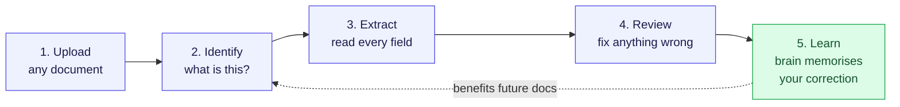
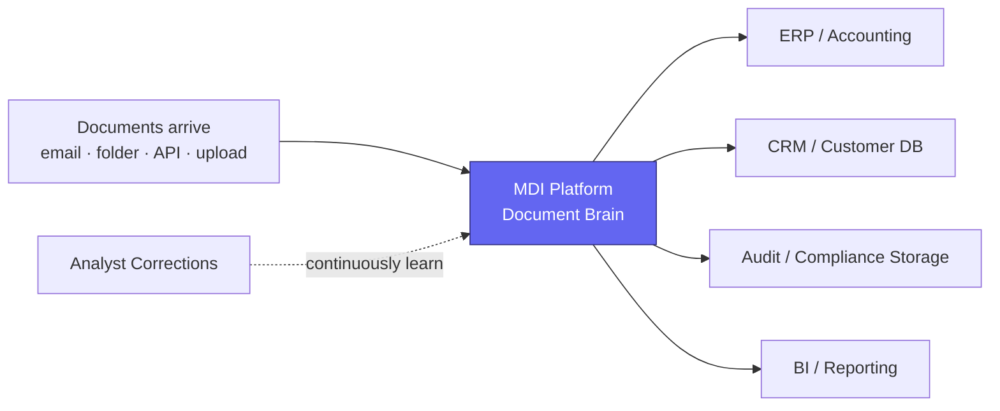
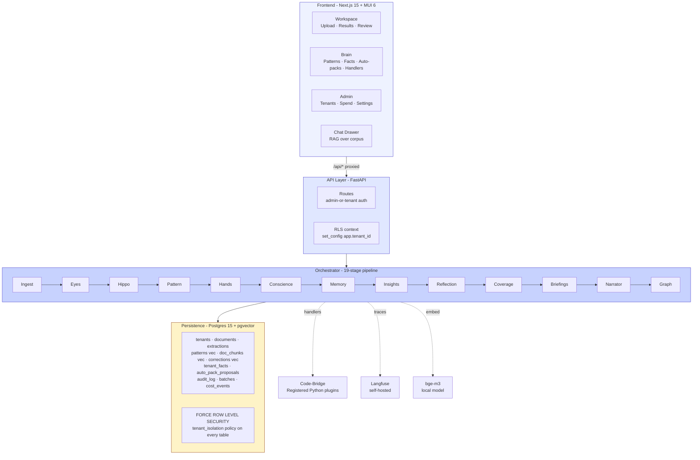
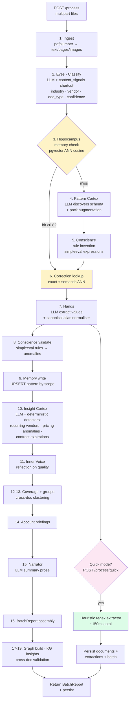
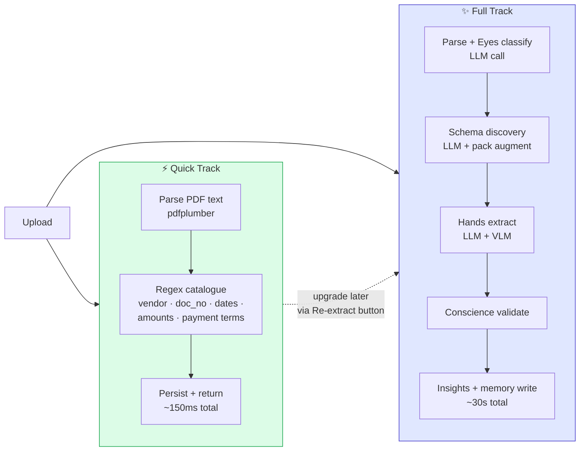
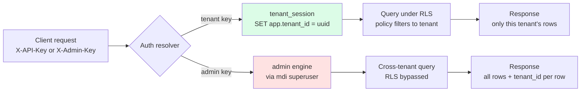
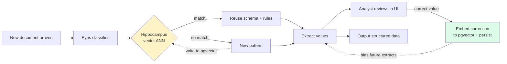

# MDI — Platform Overview

**Modular Data Intelligence** — a self-learning document brain that turns
unstructured documents (invoices, contracts, claims, certificates, statements)
into structured, auditable data.

> **One line**: *Upload any document → the brain reads it, extracts every
> field, learns the pattern, and gets smarter for the next one.*

---

## Part A — For Business Stakeholders

### The problem we solve

Every business receives documents from many vendors in many formats. Each
one needs structured data extracted — vendor, account, dates, totals, line
items, terms. Today this happens via manual data entry, per-vendor templates
that break the moment a layout changes, or rigid OCR rules that don't
generalise. **MDI replaces all of that with a learning document brain.**

### How it works (the simple version)

When you upload a document, the platform's "brain" does six things — and
remembers what it learned for next time:

| Stage | What happens (plain English) |
|---|---|
| 👁  **Eyes** | Looks at the document and identifies what it is (telecom invoice? insurance policy? purchase order?) |
| 🧠  **Memory** | Asks "have we seen something like this before?" If yes, reuses what it learned. If no, discovers a new pattern. |
| ✋  **Hands** | Reads out every field — vendor name, account, dates, amounts, line items, addresses, contract terms. |
| ⚖️  **Conscience** | Cross-checks the maths and flags anything suspicious (totals that don't add up, expired policies, missing fields). |
| 💡  **Insight Cortex** | Tells you what's interesting across the batch (recurring vendors, pricing outliers, contracts about to expire). |
| 📝  **Brain memory** | Stores the pattern so the **next** similar document is faster + more accurate. |

### Customer-facing flow (1 minute view)

### What makes MDI different

| | Traditional OCR / templating | **MDI** |
|---|---|---|
| Setup per vendor | weeks of template authoring | **zero** — discovers on first sight |
| Layout changes | breaks silently | **adapts** automatically |
| Learning from corrections | no — manual rule edits | **yes** — corrections embed semantically and bias future extractions |
| Cross-vertical | one vertical per deployment | **one platform, many verticals** — packs add insurance / telecom / healthcare / manufacturing without code change |
| LLM down? | breaks entirely | **falls back** to deterministic regex (still extracts in 150 ms) |
| Multi-tenant | per-customer instances | **single platform**, customer data isolated by row-level security |
| Audit trail | partial / no provenance | **every value** carries the exact text snippet that drove it |

### Two-speed processing (you choose per upload)

| Mode | Path | Latency | When to use |
|---|---|---|---|
| ⚡ **Quick** | Parse + regex patterns | **~150 ms** per file | Immediate inspection, demos, LLM rate-limited, large batch screening |
| ✨ **Full** | Parse + LLM (Gemini/Claude) + insights + memory | **~30 s** per file | Production extraction with full coverage + insights + pattern memory |

Both produce the same output shape. You can run Quick first, then promote
individual documents to Full later via the "Re-extract" button.

### Where MDI sits in your stack

---

## Part B — For Technical Architects

### Stack at a glance

| Layer | Technology | Reason |
|---|---|---|
| **API** | Python 3.11, FastAPI, async SQLAlchemy + asyncpg | Async-native, OpenAPI free, mature in fintech |
| **DB** | PostgreSQL 15 + pgvector + HNSW index | One engine for relational, vector ANN, audit log — minimises operational surface |
| **Tenant isolation** | PostgreSQL Row Level Security + non-superuser app role (`mdi_app`, NOBYPASSRLS) | Isolation enforced at the database, not in app logic. App bugs can't leak across tenants. |
| **Embeddings** | bge-m3 (1024 dim) via sentence-transformers | Open-weight, on-par with OpenAI ada-002, zero vendor lock-in |
| **LLM providers** | Gemini 2.5 (Flash + Pro) primary; Claude (Haiku/Sonnet/Opus) fallback | Cost-optimised primary + resilience fallback; same prompt contract via provider router |
| **VLM (vision)** | Gemini 2.5 Pro vision; Claude 3.5 Sonnet vision | Scanned PDFs route via `needs_vision: true` flag set by Eyes |
| **PDF / parsing** | pdfplumber, Docling | Text-mode + layout-aware modes |
| **Heuristic extractor** | Pure Python regex catalogue | Deterministic floor — works without any external service |
| **Observability** | Self-hosted Langfuse + structlog | Per-LLM-call trace UI, structured JSON logs |
| **Cost control** | CostTracker (in-memory daily) + SpendLedger (file-backed cumulative) | Hard cap + soft warn, raises before the API call |
| **Cache / queue** | Redis 7 | Celery broker + result backend |
| **Frontend** | Next.js 15 (App Router) + React 19 + Material UI 6 + Tanstack Query | Server-rendered hydration, accessible by default, customer-facing aesthetic |
| **Deployment** | docker-compose (dev) → containerised services (prod) | Single-command local dev; production-portable |
| **CI** | GitHub Actions — ruff + pytest + pgvector service | Lint + 160 offline tests + RLS-verified migration on every push |

### Layered architecture

### The 19-stage pipeline (full pipeline view)

### Two-track extraction strategy

### Multi-tenant security model

### Learning loop (self-training)

### Brain memory subsystems

| Subsystem | Stores | Where | Used for |
|---|---|---|---|
| **Hippocampus patterns** | Schema + rules per `(industry, vendor, doc_type)` | `patterns` table, `vector(1024)` | Skip schema discovery on next similar doc |
| **Tenant facts** | Stable per-customer truths (account→vendor, contract→expiry) | `tenant_facts` table | Cross-batch persistent knowledge |
| **Corrections** | Analyst edits with embedded context sentence | `corrections` table, `vector(1024)` | Bias future extractions toward analyst-approved values |
| **Auto-pack proposals** | Newly-discovered vendors awaiting curation | `auto_pack_proposals` | One-click pack creation; explicit promotion |
| **Handler registry** | Vetted Python callables triggerable by chat / patterns | In-process registry | Code-bridge — LLM dispatches but never executes |

### Key design decisions + reasoning

| Decision | Reason |
|---|---|
| **Open-vocabulary schema** (not fixed templates) | Vendor layouts change constantly; rigid templates need maintenance. Pattern Cortex discovers fields per-document via LLM; the canonical-alias layer keeps names stable downstream. |
| **RLS + non-superuser app role** | Tenant isolation enforced at the DB. App bugs cannot leak cross-tenant data. Verified at every migration via `FORCE ROW LEVEL SECURITY`. |
| **Two-engine DB pool** | App routes use `mdi_app` (NOBYPASSRLS). Admin cross-tenant routes use `mdi` (superuser, bypasses RLS). Separate pools prevent accidental scope creep. |
| **Provider fallback chain** | Gemini is cheap but rate-limits. Claude is the resilience layer. Same prompt contract; the router walks the chain on retryable errors. |
| **Heuristic extractor as Quick mode** | LLM availability is never 100%. Regex floor gives an always-on path. Production-grade docs (Georgetown invoices) extract 6 fields in 150 ms with `source_text` provenance. |
| **pgvector instead of a separate vector DB** | One DB to operate + backup + secure. HNSW scales to millions of vectors. Cross-table joins (extractions ↔ patterns) stay relational. |
| **Pack abstraction** (YAML, no Python) | Adding a vertical is a config commit, not a code release. Pack augmentation in Pattern Cortex unifies LLM discovery + pack-declared fields. |
| **Per-value provenance** (`source_text`) | Every extracted field carries the substring that drove it. Audit + compliance + analyst trust. |
| **Self-hosted Langfuse** | Trace every LLM call without sending prompts / customer data to a 3rd-party cloud. |
| **8px grid + WCAG AA** | Accessibility by design. MUI Material 3 tokens default-compliant. |
| **MUI + Tailwind side-by-side** | MUI for the polished primitives that need accessibility-out-of-the-box (Drawer, Table, Dialog). Tailwind for everything else. Emotion + Tailwind don't conflict at runtime. |

### API surface (what the UI calls)

| Route | Purpose |
|---|---|
| `POST /process` | Full 19-stage LLM pipeline |
| `POST /process/quick` | Heuristic-only fast lane (~150 ms / file) |
| `GET /batches` | Recent batches (admin-or-tenant auth) |
| `GET /report/{id}` | Full BatchReport for a batch |
| `GET /admin/documents/{id}/text` | Raw parsed text per document |
| `POST /admin/documents/{id}/extract-heuristic` | Re-run regex extractor on persisted doc |
| `POST /correction` | Analyst correction → pgvector embedding |
| `GET /admin/patterns` + `/{id}` | Memorised pattern explorer |
| `GET /admin/tenant-facts` | Per-tenant master data |
| `GET /admin/auto-packs` + `/{id}/promote` | Auto-discovered vendor proposals |
| `GET /admin/handlers` + `/{id}/run` | Code-bridge plugins |
| `POST /chat` | RAG over the tenant's corpus |
| `GET /admin/spend` | Cumulative LLM spend ledger |

### Operational characteristics

| Metric | Target | Today |
|---|---|---|
| Quick-mode latency | < 500 ms / file | ~150 ms |
| Full-mode latency (LLM up) | < 60 s / file | ~30 s |
| Backend offline tests | green | **160 / 160** |
| Ruff lint | clean | clean |
| Bundle size (first-load JS) | < 250 kB | ~200 kB across all routes |
| Tenant isolation | RLS-enforced | yes + `FORCE ROW LEVEL SECURITY` |
| Provider fallback | automatic | Gemini → Claude via router |

---

## Sharing this document

- **For executives + buyers**: share Part A above (mermaid renders as inline diagrams in any markdown viewer).
- **For technical architects**: share Part B (the layered diagram + pipeline diagram + decision table cover the core architecture; the API table maps directly to what the UI consumes).
- **GitHub / Notion / Confluence**: all three render Mermaid natively — paste this file in and the diagrams will appear.
- **PDF export**: `pandoc PLATFORM_OVERVIEW.md -o overview.pdf` produces a print-ready handout.

---

*Last updated: 2026-06-05 · Maintained at `mdi/docs/PLATFORM_OVERVIEW.md`.*
