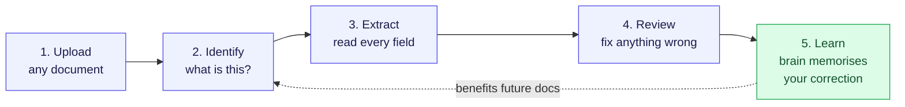
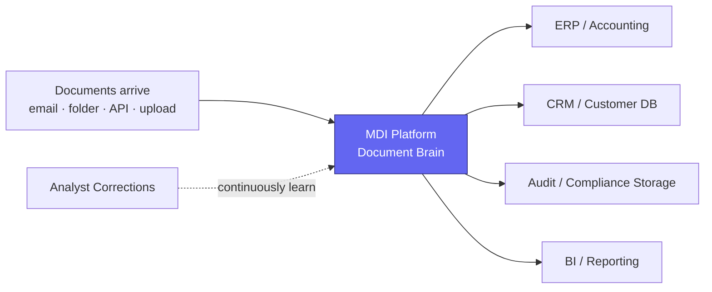
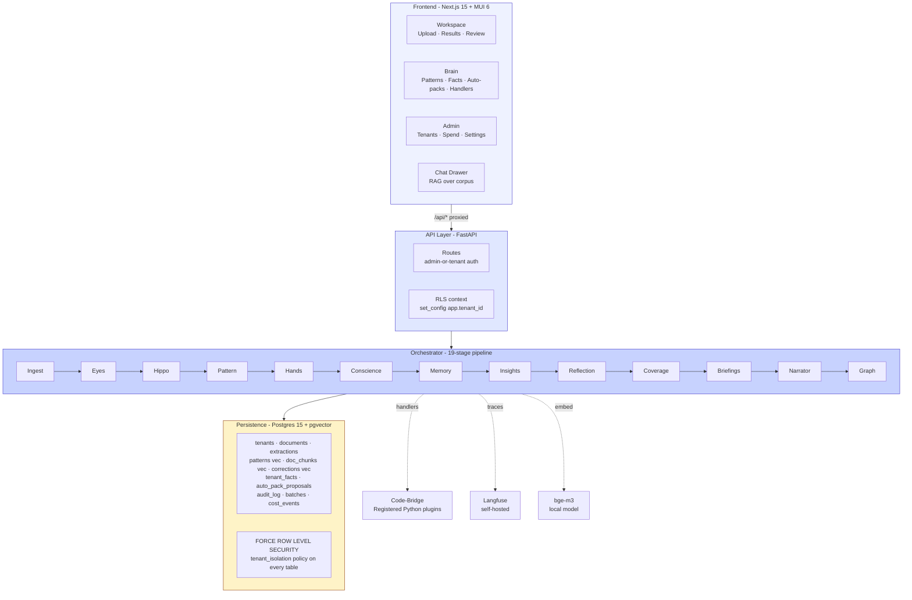
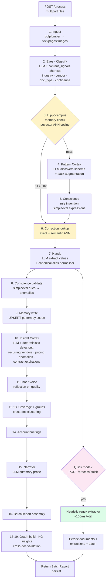
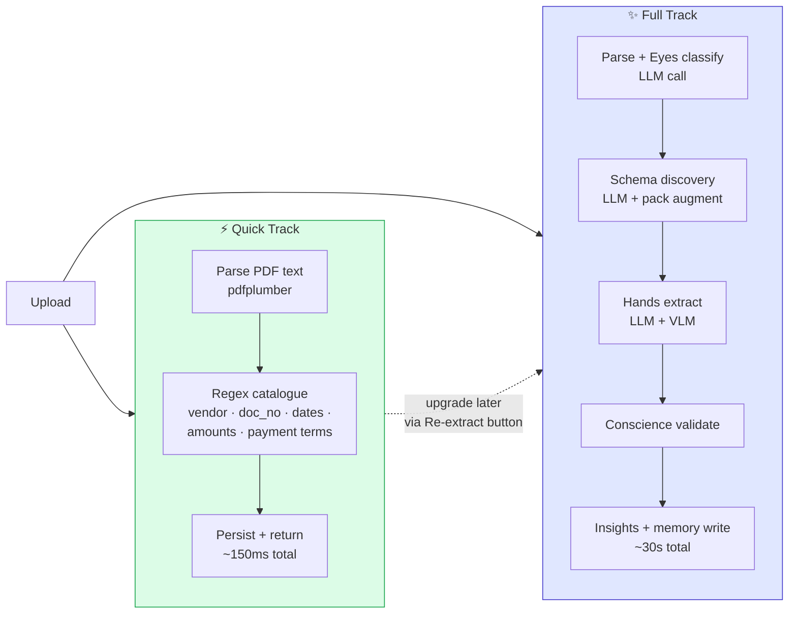
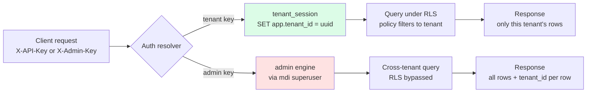
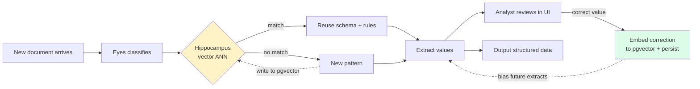
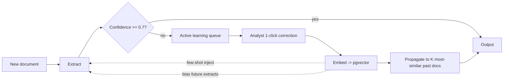
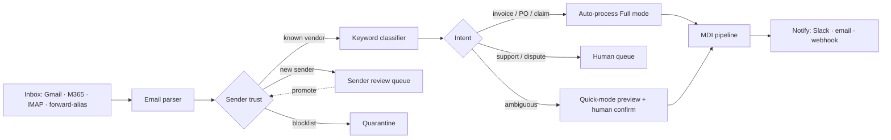
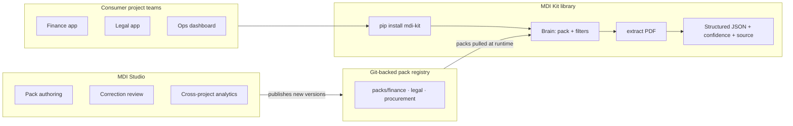

# MDI — Platform Overview

**Modular Data Intelligence** — a self-learning document brain that turns
unstructured documents (invoices, contracts, claims, certificates, statements)
into structured, auditable data.

> **One line**: *Upload any document → the brain reads it, extracts every
> field, learns the pattern, and gets smarter for the next one.*

---

## 🟢 Product direction — June 2026 · MDI ships as a library kit, not a monolithic platform

Multiple project teams across the org do document extraction independently — each reinventing the pipeline. **MDI Kit** fixes that: `pip install mdi-kit`, pick a pack, pick your filters, upload a doc, get structured JSON. Runs entirely in the consuming team's environment; Vertex AI primary, Claude fallback; per-project brain (no cross-project leakage in v1). **MDI Studio** (what's already built) remains for pack authoring, correction review, and shared analytics. Full scope in [Part D — MDI Kit v1 initiative](#part-d---mdi-kit-v1-initiative-committed); design contract in `MDI-KIT-DESIGN.md`.

---

## Part A — For Business Stakeholders

### The problem we solve

Every business receives documents from many vendors in many formats. Each
one needs structured data extracted — vendor, account, dates, totals, line
items, terms. Today this happens via manual data entry, per-vendor templates
that break the moment a layout changes, or rigid OCR rules that don't
generalise. **MDI replaces all of that with a learning document brain.**

### How it works (the simple version)

When you upload a document, the platform's "brain" does six things — and
remembers what it learned for next time:

| Stage | What happens (plain English) |
|---|---|
| 👁  **Eyes** | Looks at the document and identifies what it is (telecom invoice? insurance policy? purchase order?) |
| 🧠  **Memory** | Asks "have we seen something like this before?" If yes, reuses what it learned. If no, discovers a new pattern. |
| ✋  **Hands** | Reads out every field — vendor name, account, dates, amounts, line items, addresses, contract terms. |
| ⚖️  **Conscience** | Cross-checks the maths and flags anything suspicious (totals that don't add up, expired policies, missing fields). |
| 💡  **Insight Cortex** | Tells you what's interesting across the batch (recurring vendors, pricing outliers, contracts about to expire). |
| 📝  **Brain memory** | Stores the pattern so the **next** similar document is faster + more accurate. |

### Customer-facing flow (1 minute view)



### What makes MDI different

| | Traditional OCR / templating | **MDI** |
|---|---|---|
| Setup per vendor | weeks of template authoring | **zero** — discovers on first sight |
| Layout changes | breaks silently | **adapts** automatically |
| Learning from corrections | no — manual rule edits | **yes** — corrections embed semantically and bias future extractions |
| Cross-vertical | one vertical per deployment | **one platform, many verticals** — packs add insurance / telecom / healthcare / manufacturing without code change |
| LLM down? | breaks entirely | **falls back** to deterministic regex (still extracts in 150 ms) |
| Multi-tenant | per-customer instances | **single platform**, customer data isolated by row-level security |
| Audit trail | partial / no provenance | **every value** carries the exact text snippet that drove it |

### Two-speed processing (you choose per upload)

| Mode | Path | Latency | When to use |
|---|---|---|---|
| ⚡ **Quick** | Parse + regex patterns | **~150 ms** per file | Immediate inspection, demos, LLM rate-limited, large batch screening |
| ✨ **Full** | Parse + LLM (Gemini/Claude) + insights + memory | **~30 s** per file | Production extraction with full coverage + insights + pattern memory |

Both produce the same output shape. You can run Quick first, then promote
individual documents to Full later via the "Re-extract" button.

### Where MDI sits in your stack



---

## Part B — For Technical Architects

### Stack at a glance

| Layer | Technology | Reason |
|---|---|---|
| **API** | Python 3.11, FastAPI, async SQLAlchemy + asyncpg | Async-native, OpenAPI free, mature in fintech |
| **DB** | PostgreSQL 15 + pgvector + HNSW index | One engine for relational, vector ANN, audit log — minimises operational surface |
| **Tenant isolation** | PostgreSQL Row Level Security + non-superuser app role (`mdi_app`, NOBYPASSRLS) | Isolation enforced at the database, not in app logic. App bugs can't leak across tenants. |
| **Embeddings** | bge-m3 (1024 dim) via sentence-transformers | Open-weight, on-par with OpenAI ada-002, zero vendor lock-in |
| **LLM providers** | Gemini 2.5 (Flash + Pro) primary; Claude (Haiku/Sonnet/Opus) fallback | Cost-optimised primary + resilience fallback; same prompt contract via provider router |
| **VLM (vision)** | Gemini 2.5 Pro vision; Claude 3.5 Sonnet vision | Scanned PDFs route via `needs_vision: true` flag set by Eyes |
| **PDF / parsing** | pdfplumber, Docling | Text-mode + layout-aware modes |
| **Heuristic extractor** | Pure Python regex catalogue | Deterministic floor — works without any external service |
| **Observability** | Self-hosted Langfuse + structlog | Per-LLM-call trace UI, structured JSON logs |
| **Cost control** | CostTracker (in-memory daily) + SpendLedger (file-backed cumulative) | Hard cap + soft warn, raises before the API call |
| **Cache / queue** | Redis 7 | Celery broker + result backend |
| **Frontend** | Next.js 15 (App Router) + React 19 + Material UI 6 + Tanstack Query | Server-rendered hydration, accessible by default, customer-facing aesthetic |
| **Deployment** | docker-compose (dev) → containerised services (prod) | Single-command local dev; production-portable |
| **CI** | GitHub Actions — ruff + pytest + pgvector service | Lint + 160 offline tests + RLS-verified migration on every push |

### Layered architecture



### The 19-stage pipeline (full pipeline view)



### Two-track extraction strategy



### Multi-tenant security model



### Learning loop (self-training)



### Brain memory subsystems

| Subsystem | Stores | Where | Used for |
|---|---|---|---|
| **Hippocampus patterns** | Schema + rules per `(industry, vendor, doc_type)` | `patterns` table, `vector(1024)` | Skip schema discovery on next similar doc |
| **Tenant facts** | Stable per-customer truths (account→vendor, contract→expiry) | `tenant_facts` table | Cross-batch persistent knowledge |
| **Corrections** | Analyst edits with embedded context sentence | `corrections` table, `vector(1024)` | Bias future extractions toward analyst-approved values |
| **Auto-pack proposals** | Newly-discovered vendors awaiting curation | `auto_pack_proposals` | One-click pack creation; explicit promotion |
| **Handler registry** | Vetted Python callables triggerable by chat / patterns | In-process registry | Code-bridge — LLM dispatches but never executes |

### Key design decisions + reasoning

| Decision | Reason |
|---|---|
| **Open-vocabulary schema** (not fixed templates) | Vendor layouts change constantly; rigid templates need maintenance. Pattern Cortex discovers fields per-document via LLM; the canonical-alias layer keeps names stable downstream. |
| **RLS + non-superuser app role** | Tenant isolation enforced at the DB. App bugs cannot leak cross-tenant data. Verified at every migration via `FORCE ROW LEVEL SECURITY`. |
| **Two-engine DB pool** | App routes use `mdi_app` (NOBYPASSRLS). Admin cross-tenant routes use `mdi` (superuser, bypasses RLS). Separate pools prevent accidental scope creep. |
| **Provider fallback chain** | Gemini is cheap but rate-limits. Claude is the resilience layer. Same prompt contract; the router walks the chain on retryable errors. |
| **Heuristic extractor as Quick mode** | LLM availability is never 100%. Regex floor gives an always-on path. Production-grade docs (Georgetown invoices) extract 6 fields in 150 ms with `source_text` provenance. |
| **pgvector instead of a separate vector DB** | One DB to operate + backup + secure. HNSW scales to millions of vectors. Cross-table joins (extractions ↔ patterns) stay relational. |
| **Pack abstraction** (YAML, no Python) | Adding a vertical is a config commit, not a code release. Pack augmentation in Pattern Cortex unifies LLM discovery + pack-declared fields. |
| **Per-value provenance** (`source_text`) | Every extracted field carries the substring that drove it. Audit + compliance + analyst trust. |
| **Self-hosted Langfuse** | Trace every LLM call without sending prompts / customer data to a 3rd-party cloud. |
| **8px grid + WCAG AA** | Accessibility by design. MUI Material 3 tokens default-compliant. |
| **MUI + Tailwind side-by-side** | MUI for the polished primitives that need accessibility-out-of-the-box (Drawer, Table, Dialog). Tailwind for everything else. Emotion + Tailwind don't conflict at runtime. |

### API surface (what the UI calls)

| Route | Purpose |
|---|---|
| `POST /process` | Full 19-stage LLM pipeline |
| `POST /process/quick` | Heuristic-only fast lane (~150 ms / file) |
| `GET /batches` | Recent batches (admin-or-tenant auth) |
| `GET /report/{id}` | Full BatchReport for a batch |
| `GET /admin/documents/{id}/text` | Raw parsed text per document |
| `POST /admin/documents/{id}/extract-heuristic` | Re-run regex extractor on persisted doc |
| `POST /correction` | Analyst correction → pgvector embedding |
| `GET /admin/patterns` + `/{id}` | Memorised pattern explorer |
| `GET /admin/tenant-facts` | Per-tenant master data |
| `GET /admin/auto-packs` + `/{id}/promote` | Auto-discovered vendor proposals |
| `GET /admin/handlers` + `/{id}/run` | Code-bridge plugins |
| `POST /chat` | RAG over the tenant's corpus |
| `GET /admin/spend` | Cumulative LLM spend ledger |

### Operational characteristics

| Metric | Target | Today |
|---|---|---|
| Quick-mode latency | < 500 ms / file | ~150 ms |
| Full-mode latency (LLM up) | < 60 s / file | ~30 s |
| Backend offline tests | green | **160 / 160** |
| Ruff lint | clean | clean |
| Bundle size (first-load JS) | < 250 kB | ~200 kB across all routes |
| Tenant isolation | RLS-enforced | yes + `FORCE ROW LEVEL SECURITY` |
| Provider fallback | automatic | Gemini → Claude via router |

---

# Part C — Proposed Solutions & Future Roadmap  *(future)*

Everything below is a deliberate next step — pieces we've designed for but haven't shipped yet. Sections are written so any one can be lifted straight into an implementation ticket. Priority pills indicate suggested build order (**P0** ship next → **P3** nice-to-have).

## 1. Self-training & continuous learning

The brain already memorises patterns and embeds analyst corrections, but the loop only closes when someone opens a document. The capabilities below let the loop close on its own.

| Capability | Priority | What it does |
|---|---|---|
| **Active learning queue** | P0 | Extractions with confidence < 0.7 (or provider disagreement) go into a review queue with source text highlighted. One click ⇒ embedding ⇒ all similar future docs benefit. |
| **Correction propagation** | P0 | On correction, ANN-search the corpus and silently re-extract the top-K most-similar past documents. Today we only bias future docs; this also fixes the past. |
| **Pattern confidence decay** | P1 | Patterns not re-seen in 90 days lose match weight. Prevents stale layouts from dominating when vendors change templates. |
| **Auto-pack auto-promotion** | P1 | Proposals that score ≥ 0.85 across N consecutive matches promote to first-class packs automatically. |
| **Few-shot from corrections** | P1 | At extraction time, pull the 3 most-similar prior corrections via pgvector ANN and inject as ad-hoc few-shot examples in the Hands prompt. |
| **Synthetic doc augmentation** | P2 | Once a pattern has 5+ corrections, Gemini Pro generates 20 synthetic layout variations + value pairs. Feeds regex + eval harness. |
| **Per-tenant prompt overrides** | P2 | Each tenant supplies a 200-word "house style" preamble. Encodes things like "we always treat 'Net 30' as Net-30 from invoice date." |
| **Tenant-scoped fine-tuning** | P3 | Once a tenant has 10 k+ corrections, fine-tune Llama 3 8B per-tenant. Routes their docs through the fine-tune first, falls back to Gemini on low confidence. |


*Figure 8 — Closed-loop self-training: one correction propagates both forward (future docs) and backward (past docs).*

## 2. Domain- & dataset-specific extensibility

Some verticals carry rules that can't be discovered from documents alone. Three lanes to inject that knowledge:

| Lane | For whom | Mechanism |
|---|---|---|
| **YAML pack** | Domain expert *(no Python)* | Drop YAML into `packs/<industry>/` — schema, rules, validators, enrichment. Hot-reloaded. Already works for insurance + telecom. |
| **Code-bridge handler** | Engineer *(vetted Python)* | Register a Python callable in `brain/handlers/`. LLM dispatches by name but never executes. Use for tax tables, live FX, ERP API calls, business-logic validators. |
| **Dataset bootstrap** | Customer *(zero-code)* | Upload 5–10 labelled examples → LLM-as-judge generates a draft pack YAML + regex catalogue → customer reviews and commits. |

### Example — customer-uploaded bootstrap sample

```jsonc
// POST /admin/bootstrap-pack — 6 labelled samples is usually enough
{
  "vertical": "logistics",
  "vendor_hint": "DHL",
  "samples": [
    {
      "file": "sample-1.pdf",
      "labels": {
        "awb_number": "7651234890",
        "origin": "DEL",
        "destination": "FRA",
        "weight_kg": 12.4,
        "chargeable_weight_kg": 14.0,
        "freight_charge_usd": 187.50
      }
    }
    // ... 4–9 more samples ...
  ]
}

// Brain returns a generated pack scaffold:
//   - schema/fields.yaml        ← 6 field definitions inferred
//   - rules/validators.yaml     ← weight ≤ chargeable_weight invariant
//   - prompts/awb.md            ← air-waybill-specific prompt
//   - heuristic regex patches   ← AWB number format (10-digit, optional dash)
```

### Domain glossary vector store

```csv
# telecom-glossary.csv
term,definition,canonical
MRC,Monthly Recurring Charge,monthly_recurring_charge
NRC,Non-Recurring Charge,non_recurring_charge
USF,Universal Service Fund fee,usf_surcharge
CSR,Customer Service Record,customer_service_record
SIP DID,Session Initiation Protocol Direct Inward Dial,sip_did_number
```

### When to hard-code Python (and how to keep it safe)

```python
# brain/handlers/fx_convert.py
from mdi.brain.bridge import register_handler

@register_handler(
    name="fx.convert",
    description="Convert an amount between currencies using daily ECB rates.",
    schema={"amount": "float", "from": "str", "to": "str"},
)
def fx_convert(amount: float, from_: str, to: str) -> dict:
    rate = _fetch_ecb_rate(from_, to)         # cached, daily refresh
    return {"value": amount * rate, "rate": rate, "source": "ECB"}

# The LLM emits {"call": "fx.convert", "args": {...}} in its output.
# The bridge validates against the schema, runs the handler, splices
# the result back. The model NEVER executes Python — only describes it.
```

## 3. Email & inbox integration

### Supported sources (roadmap)

| Source | Mechanism | Notes |
|---|---|---|
| Gmail / Google Workspace | OAuth2 + Gmail API | Polling, or push via Pub/Sub `watch()` |
| Microsoft 365 / Outlook | Graph API + Microsoft auth | Subscription-based push |
| Generic IMAP | Long-poll IDLE | Self-hosted mail servers |
| Forwarding alias | `uploads@<tenant>.mdi.app` | Zero-integration — just forward |

### What the email parser extracts per inbound message

```jsonc
{
  "thread_id": "<CAOj+abc123@gmail.com>",
  "sender": {
    "email": "billing@georgetownpaper.com",
    "name":  "Georgetown Paper Stock",
    "domain_trust": "known_vendor"     // known_vendor | new | suspicious
  },
  "subject": "Invoice INV-44128 — May 2026",
  "keywords_matched": ["invoice", "INV-", "month + year"],
  "intent_guess":  "new_invoice",
  "attachments": [
    {
      "name": "INV-44128.pdf",
      "size": 84320,
      "sha256": "e3b0c4...",
      "route":  "process_now"
    }
  ],
  "body_extracted": {
    "document_number": "INV-44128",
    "period":          "May 2026",
    "amount_due":      12450.00,
    "due_date":        "2026-06-30"
  },
  "linked_documents": ["doc_b8a2..."]   // prior invoices from same sender
}
```

### Subject-line keyword catalogue (initial set)

| Intent | Keywords (subject or body) | Routing |
|---|---|---|
| **new_invoice** | `invoice` · `INV-` · `bill` · `statement` · `remittance` · `payment due` · `tax invoice` · `amount due` | Auto-process Full mode |
| **purchase_order** | `PO #` · `purchase order` · `order confirmation` · `P.O.` · `order ack` | Auto-process + match to invoices |
| **contract** | `agreement` · `MSA` · `SOW` · `renewal` · `addendum` · `amendment` · `NDA` | Route to legal-review queue |
| **claim** | `claim no` · `policy #` · `loss notice` · `adjuster` · `FNOL` · `subrogation` | Insurance pack pipeline |
| **receipt / paid** | `receipt` · `paid` · `payment confirmation` · `thank you for your payment` · `transaction` | Reconcile to prior invoice |
| **support / dispute** | `issue` · `dispute` · `incorrect` · `refund` · `complaint` | Skip extraction, queue for human |
| **reminder** | `overdue` · `past due` · `reminder` · `2nd notice` · `final notice` | Link to existing invoice, raise priority |

### Auto-routing rules (customer-configurable, hot-reloaded YAML)

```yaml
routing:
  - when:
      sender_domain: "georgetownpaper.com"
      subject_contains: ["invoice", "INV-"]
    then:
      tenant_id:        "tenant_acme_corp"
      batch_label:      "Georgetown Monthly"
      extraction_mode:  "full"
      notify_on_anomaly: "#ops-channel"

  - when:
      sender_domain: "*.untrusted-domain.tld"
    then:
      action: "quarantine"
      notify: "security@tenant.com"

  - when:
      subject_matches: "^Claim.*"
      attachment_count: ">= 1"
    then:
      pack:             "insurance"
      extraction_mode:  "full"
      assignee:         "claims-desk@tenant.com"
```


*Figure 9 — Inbound email pipeline: sender-trust gate → keyword classifier → intent-routed processing.*

## 4. Expected scenarios & platform behaviour

| Scenario | Today's behaviour | Target behaviour |
|---|---|---|
| **New vendor, first doc** | Hippocampus miss → Pattern Cortex discovers (~30 s) | + "first-seen vendor" badge so analyst pays extra attention |
| **Known vendor, layout changed** | Pattern still matches; new fields may be wrong | Detect drift via embedding distance > threshold ⇒ re-run discovery, version the pattern |
| **Multi-currency** | Currency extracted as string; no conversion | Detect currency code → `fx.convert` handler ⇒ store both original + base-currency |
| **Multi-language** | EN + basic ES/FR; degrades silently otherwise | Eyes detects language ⇒ language-specific prompt; translation fallback |
| **Scanned PDF (image only)** | Marked "needs review" — no text | VLM (Gemini 2.5 Pro vision) path: same schema, OCR-via-LLM, lower confidence cap |
| **Mixed batch (invoices + POs + receipts)** | Each doc classified independently | + cross-doc reconciliation: receipts → invoices → POs matched inside the batch |
| **High-volume batch (1 k+ docs)** | Sync `/process` times out | Async polling + per-doc status + webhook on batch completion |
| **Duplicate document** | Re-extracted from scratch | SHA256 fingerprint cache ⇒ return prior extraction in < 5 ms |
| **Multi-page table spanning pages** | Header repeated ⇒ may extract duplicates | Detect continuation via header similarity; stitch into one logical table |
| **Handwritten annotation on printed form** | Often missed | Region-based VLM call on handwriting-detected zones |
| **Two analysts disagree on a correction** | Last-write-wins, silent | Surface as conflict in Brain UI; supervisor resolves; loser kept as context |

## 5. Gap closures — concrete tickets

| Gap | Priority | Approach |
|---|---|---|
| Sync `/process` times out on large batches | P0 | Async job model: `POST /process` returns `batch_id` immediately; `GET /batches/{id}/status` per-doc state; optional SSE stream |
| No webhook notifications | P0 | Per-tenant webhook URL + HMAC secret; fire on batch-complete, on each correction, on anomaly threshold |
| Image-only PDFs marked unreadable | P1 | VLM path exists; wire it to the `needs_vision` flag Eyes already sets |
| No bulk import from S3 / GCS / SharePoint / Drive | P1 | Connector pattern — one credential per source, scheduled poll, idempotent ingest keyed on file path + SHA |
| Document fingerprint cache | P1 | SHA256 parsed text ⇒ cache key → extraction JSON for 30 days; skips LLM on every repeat |
| Schema versioning | P2 | Each pattern row gets `version` + `supersedes`; old extractions stay queryable under the version they were produced under |
| Table-aware extraction | P2 | Docling's structure-aware mode; LLM only on header rows, regex on body rows |
| Conflict-resolution UI | P2 | New Brain tab "Conflicts" lists disagreeing corrections; supervisor picks winner |
| Provider routing by complexity | P3 | Cheap doc → Flash; complex doc → Pro; fallback chain unchanged |
| Handwriting-specialised OCR | P3 | VLM detects zones → TrOCR-style specialised model |

## 6. Cost & throughput optimisations

| Lever | Expected impact |
|---|---|
| SHA256 doc-fingerprint cache | ~15 % of repeat traffic skips the LLM entirely |
| Embedding cache (text → vector) | Cuts bge-m3 compute ~40 % on retried batches |
| Provider routing by complexity | ~60 % spend reduction on Flash-eligible docs |
| Batched LLM calls (multi-doc per prompt) | ~25 % latency reduction on small docs |
| Quick-mode auto-acceptance on high-confidence | ~30 % of routine invoices never need a Full-mode call |

## 7. Suggested build order

| Sprint | Theme | Tickets |
|---|---|---|
| **Sprint 1** (2 wks) | Async + observability | Async `/process` · webhook firing · active learning queue UI |
| **Sprint 2** (2 wks) | Email ingestion v1 | Gmail OAuth + polling · subject-line classifier · forwarding alias · auto-routing YAML |
| **Sprint 3** (2 wks) | Self-training v1 | Correction propagation · few-shot from corrections · auto-pack auto-promotion |
| **Sprint 4** (3 wks) | VLM + handwriting | VLM path wired to `needs_vision` · scanned-PDF flow · domain glossary uploader |
| **Sprint 5** (2 wks) | Dataset bootstrap | Upload-samples API · pack scaffolder · regex generator · per-tenant prompt overrides |
| **Sprint 6** (2 wks) | Cost + scale | Fingerprint cache · embedding cache · provider routing by complexity |

> **Hold-it bucket — park until a customer asks**: tenant-scoped fine-tuning · M365 Graph push subscription · handwriting-specialised OCR · multi-region GDPR sharding · on-prem deployment kit.

---

# Part D — MDI Kit v1 initiative  *(committed)*

This is the current build direction. Everything in Parts A/B/C still holds — but **how** we ship it changes: the extraction brain is packaged as a Python library any project team can embed, not a platform every team logs into. Studio remains for pack authoring and correction review. Full API design contract lives in `MDI-KIT-DESIGN.md` at the repo root.

## 1. Two products, cleanly separated

| Product | What it is | Who uses it | Ships as |
|---|---|---|---|
| **MDI Kit** *(new — the library)* | The extraction brain, packaged. Import it, pick a pack + filters, get JSON out with confidence + provenance. | Engineers embedding extraction into their own apps. | `pip install mdi-kit` · CLI · Docker image · REST client (stub) |
| **MDI Studio** *(what's built today)* | The hosted UI + shared learning + pack-authoring surface. Existing FastAPI + Next.js stack. | Pack authors · analysts reviewing extractions · admins. | Existing platform, imports from `mdi-core`. |

> **Rule of thumb:** Studio *produces* packs. Kit *consumes* them. Kit runs in each team's own environment; Studio is where the brain matures. This separation turns MDI from "another platform" into an "extraction primitive."

## 2. What a consumer's code looks like

```python
from mdi_kit import Brain

brain = Brain(
    pack="finance/invoice_v1",
    filters=["vendor", "amount_due", "line_items", "due_date"],
)

result = brain.extract("path/to/invoice.pdf")

print(result.fields)          # {vendor: "GEORGETOWN PAPER STOCK", amount_due: 12450.00, ...}
print(result.confidence)      # {vendor: 0.94, amount_due: 0.98, ...}
print(result.source_text)     # {vendor: "GEORGETOWN PAPER STOCK\n1234 Mill Rd", ...} ← provenance
```

That's the whole embedding cost for a project team. No pipeline setup, no LLM keys in their code, no pgvector. If they want learning + corrections, they graduate to stateful mode with their own Postgres.

## 3. Kit ↔ Studio flow


*Figure 10 — Kit runs in each consumer's environment; Studio publishes packs to the shared registry; consumers pull packs at runtime.*

## 4. What's in v1

| # | Deliverable | What it is |
|---|---|---|
| 1 | **`mdi-kit` Python package** | Wraps the existing pipeline (Eyes → Hippocampus → Pattern Cortex → Hands → Conscience). PyPI-installable. |
| 2 | **Pack composability** | Teams pick a base pack AND override the filter set. Kit resolves only requested fields. |
| 3 | **Vertex AI adapter** | New adapter in the existing `llm_gateway` — teams pass GCP project/region/service account. Claude fallback via same gateway. |
| 4 | **Two run modes** | *Stateless* (extract-and-forget, in-memory) *and* *Stateful* (bring-your-own-Postgres with pgvector). |
| 5 | **CLI** | `mdi-kit extract --pack invoice_v1 file.pdf` for one-off use. `mdi-kit packs list/pull/push` for pack management. |
| 6 | **Git-backed pack registry** | Packs live in a private org Git repo. Kit pulls/versions them (`pack@1.2.3`). Zero new infrastructure. |
| 7 | **3 reference packs** | `finance/invoice_v1`, `legal/contract_v1`, `procurement/po_v1`. Real, working, tested. |
| 8 | **Docs + 3 examples** | 5-line getting-started, filter composition guide, custom pack authoring guide. |
| 9 | **Docker image** | Optional — for teams that want stateful mode without provisioning their own Postgres. |

## 5. Explicitly out of v1 (parked for v2)

| Deferred item | Why parked |
|---|---|
| Shared cross-project brain | Requires legal/compliance sign-off per consuming team. V1 keeps brain private per project. |
| Hosted SaaS API | Library-first was the chosen consumption model. |
| JS/TS SDK | Most extraction consumers are backend/data teams. Python covers 90% of demand for v1. |
| Cross-org pack marketplace | Org-private packs only. |
| Studio ↔ Kit live sync | Studio publishes to registry; Kit pulls on demand. No real-time link for v1. |

## 6. The enabling refactor — repository restructure

```
mdi/
  packages/
    mdi-core/       ← pure extraction pipeline · no HTTP · no UI
    mdi-kit/        ← consumer-facing library · imports mdi-core
    mdi-studio/     ← existing FastAPI + Next.js · imports mdi-core
    mdi-packs/      ← YAML packs · published to git-backed registry
```

This is the **first tangible step** and unblocks everything else. Highest-risk item because the current code has HTTP handlers, DB sessions, and pipeline stages tangled together. 1–2 weeks of careful work; everything downstream is mechanical once done.

## 7. Sequencing (rough 6-week estimate)

| Week | Theme | Milestone |
|---|---|---|
| **1–2** | Core extraction refactor | Extract pipeline from platform into standalone `mdi-core`. Add Vertex AI provider. Ship stateless mode + minimal CLI. Internal alpha. |
| **3** | Pack composability | Filter selection layer. Refactor existing packs. |
| **4** | Stateful mode + reference packs | Bring-your-own-Postgres. Ship 3 reference packs against real samples. |
| **5** | Docs + first consumer | Docs site (or README-heavy). First internal team onboarded end-to-end. |
| **6** | Iterate + v1.0 tag | Fix whatever the first consumer surfaced. Cut `v1.0`. Announce internally. |

## 8. Technology stack — what earns its keep

| Layer | Choice | Why |
|---|---|---|
| **LLM provider** | Vertex AI primary + Claude via Bedrock fallback | Vertex gives enterprise auth, org-level quotas, VPC, per-project GCP billing. Existing gateway abstraction keeps the swap clean. |
| **Observability** | Self-hosted Langfuse (per-project or shared with project-tag scoping) | Each project team sees only their own traces. Kit auto-tags every LLM call with `project_id`. |
| **Parsing** | pdfplumber + Docling | Already in the stack. Docling gives layout-aware parsing for tables. |
| **Embeddings** | bge-m3 (local via sentence-transformers) | No per-team API key. Ships inside the kit. |
| **Vector store** | pgvector in caller's Postgres OR ephemeral in-memory | Kit supports both. |
| **Pack registry** | Git-backed (private repo per org), OCI later | Packs are YAML — versioning + PR review + rollback come free from Git. |
| **Filter primitives** | Declarative composition layer over packs | Teams compose `["vendor", "amount_due"]` from any pack that defines them. |

## 9. What "v1 done" looks like

| Criterion | Measurable target |
|---|---|
| Consumer onboarding cost | ≤ 10 lines of Python from `pip install` to first structured extraction |
| First-doc latency (stateless, Quick mode) | < 500 ms per file |
| First-doc latency (stateless, Full mode via Vertex) | < 45 s per file |
| Reference packs shipped | 3 packs (invoice, contract, PO), each with ≥ 5 sample documents and ≥ 85% field-level accuracy on those samples |
| Docs completeness | Getting-started · filter composition · custom pack authoring · provider config · troubleshooting — 5 pages minimum |
| First real consumer | At least one internal team using it against their own document corpus without hand-holding |

> **What we need from stakeholders before build starts:** (a) confirm the first consumer project team so we build against their real docs, not synthetic; (b) confirm GCP project structure (each consuming team in their own project, or shared). Neither is blocking — but both meaningfully improve v1 quality.

---

## Sharing this document

- **For executives + buyers**: share Part A above (mermaid renders as inline diagrams in any markdown viewer).
- **For technical architects**: share Part B (the layered diagram + pipeline diagram + decision table cover the core architecture; the API table maps directly to what the UI consumes).
- **For product / planning**: share Parts C + D — C is the broader roadmap, D is the committed v1 initiative with concrete deliverables and sequencing.
- **For engineering onboarding onto v1**: read `MDI-KIT-DESIGN.md` at the repo root — the full API design contract.
- **GitHub / Notion / Confluence**: all three render Mermaid natively — paste this file in and the diagrams will appear.
- **PDF export**: `pandoc platform-overview.md -o overview.pdf` produces a print-ready handout.

---

*Last updated: 2026-06-05 · Maintained at `mdi/documents/platform-overview.md` · HTML mirror at `mdi/documents/platform-overview.html` · v1 design contract at `MDI-KIT-DESIGN.md`.*
